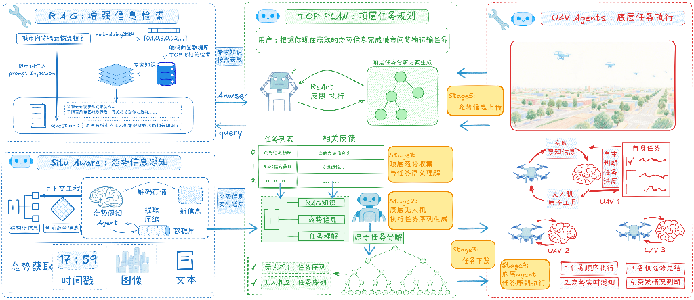
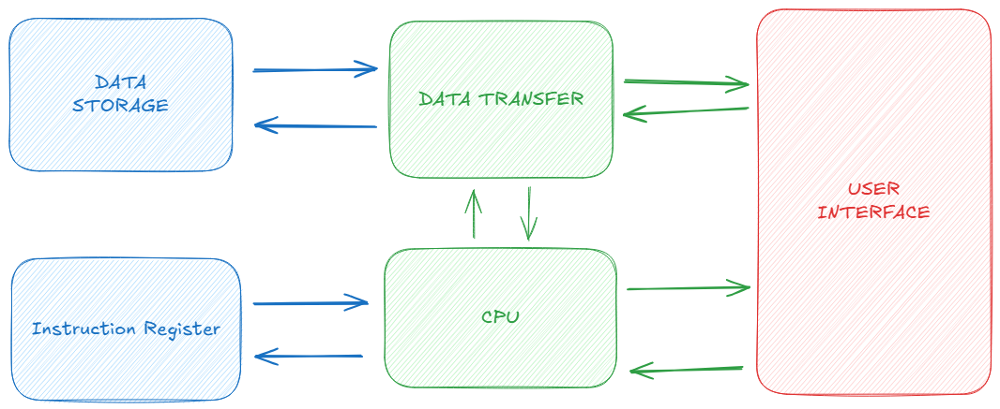

# The Future of Multi-Agent AI Frameworks – A CPU-Inspired Revolution
### Core Insight: LLM Agent Architecture Mirrors Computer Hardware Hierarchy  
Multi-agent systems (e.g., drone swarm coordination frameworks) exhibit deep structural parallels with computer architecture - **the "memory-cache-storage" layering in LLM Agents perfectly mirrors CPU memory hierarchies**, as shown in this architecture:  
  

#### **1. Long-Term Memory (Hard Disk Equivalent)**  
- Vector databases store historical experience and expert knowledge  
- RAG modules compress semantics into high-dimensional vectors (`[0.1, 0.5, ...]`)  
- Enables cross-session persistence like permanent disk storage  

#### **2. Context Cache (RAM Equivalent)**  
- TOP PLAN modules dynamically manage task states via ReAct framework  
- Leverages **vLLM's PagedAttention technology** for chunked KV caching  
- Solves context window fragmentation in traditional Transformers  
- Mimics memory paging mechanisms in operating systems  

#### **3. Parallel Execution (Multi-Core Equivalent)**  
- UAV agent clusters operate as distributed compute units  
- Synchronize state through shared situational databases  
- Enable task-level pipeline concurrency (perception → decision → execution)  
- Functions like multi-core CPU SIMD instruction sets  